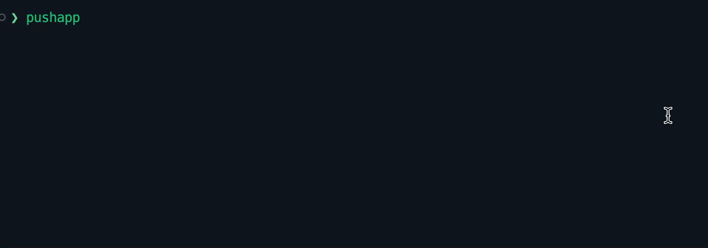

# 🚀 Pushapp CLI 🏋🏻‍♂️

⚡ Ultra fast dependencies updater for Node.js written in Rust! ⚡

[![Latest Version]][crates.io]

[Latest Version]: https://img.shields.io/crates/v/pushapp-cli.svg
[crates.io]: https://crates.io/crates/pushapp-cli




## Features

- [x] Package.json dependencies updater
- [x] Support for npm, pnpm, yarn and bun
- [x] Interactive packages selection
- [x] Autocomplete package search
- [x] Colored updatable packages based on semver diff
- [ ] Monorepo support
- [ ] CLI utility flags (e.g. --help, --only-dev)

## Installation

```bash
cargo install pushapp-cli
```

## Usage

Run the following command in your Node.js project directory:

```bash
pushapp
```

## License

This project is licensed under the MIT License - see the [LICENSE](LICENSE) file for details.

## Author

- Flavio Delgrosso
